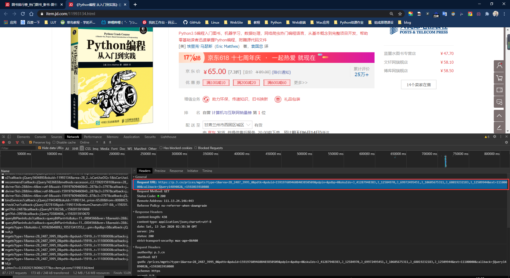
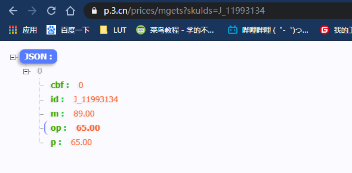
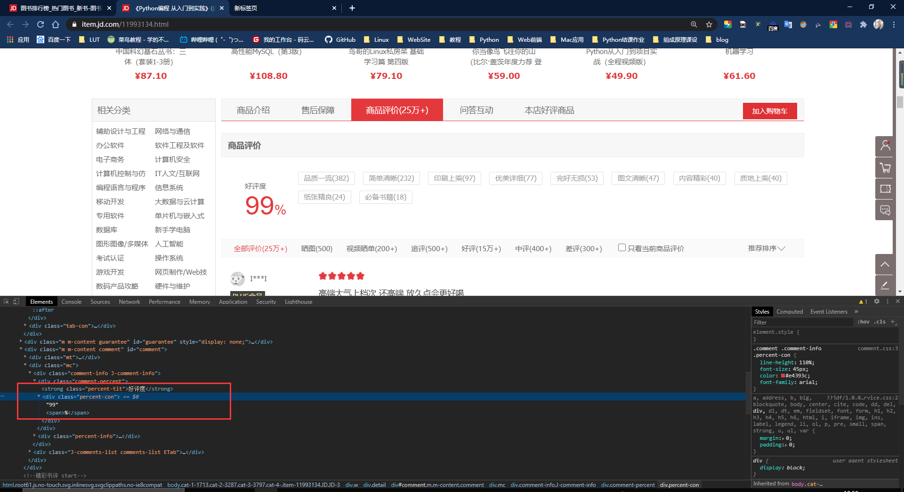
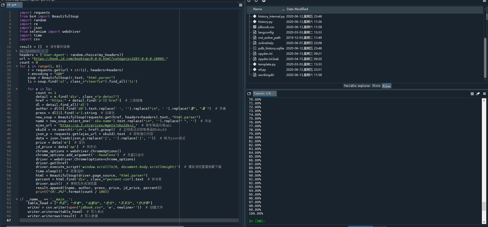
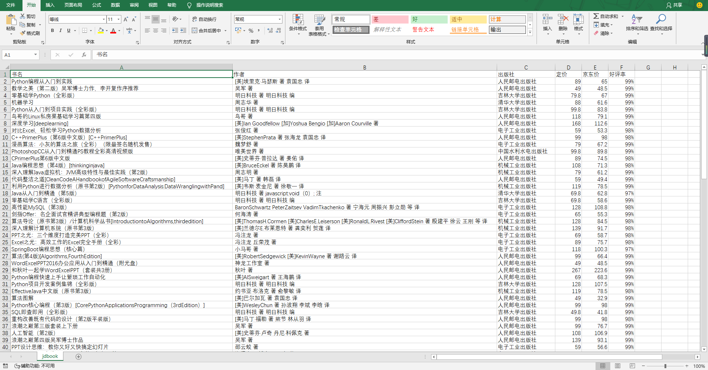

### 题目：

从京东爬取2019年 “计算与互联网”的图书销量榜，包括图书的"书名", "作者", "出版社", "定价", "京东价", "好评率"，存入csv文件中。

==注：网页结构及数据接口地址有可能发生变化，因此不能保证其时效性。==

​    ==所有图片存放在jd.assets目录下。==

### 分析

爬取网页[https://book.jd.com/booktop/0-0-0.html?category=3287-0-0-0-5-1](https://book.jd.com/booktop/0-0-0.html?category=3287-0-0-0-5-1)


###### 需要安装的库：

```python
import requests
from bs4 import BeautifulSoup
import random
import re
import json
from selenium import webdriver
import time
import csv
```

==运行selenium还需下载相应浏览器的驱动，并且拷贝到python的安装目录。==

首先分析url中最后以为数字代表页数，由此可以通过拼接url的方式得到2019年的共5页的url。

```python
url = "https://book.jd.com/booktop/0-0-0.html?category=3287-0-0-0-10005-"
count = 0
for i in range(1, 6):
    r = requests.get(url + str(i), headers=headers)
    r.encoding = "GBK"
    soup = BeautifulSoup(r.text, "html.parser")
    li = soup.find('ul', class_="clearfix").find_all('li')
```

使用bs4库对返回的页面进行解析，获取“作者”和“出版社”并保存在变量中。

```python
for e in li:
    count += 1
    detail = e.find('div', class_="p-detail")
    href = "https:" + detail.find('a')['href']  # 二级链接
    dl = detail.find_all('dl')
    author = dl[0].find('dd').text.replace(' ', '').replace("\n", ' ').replace("著", "著 ")  # 作者
    press = dl[1].find('a').string  # 出版社
```

因书名在当前页面显示不完整，所以在商品详情页面获取。

```python
new_soup = BeautifulSoup(requests.get(href, headers=headers).text, "html.parser")
name = new_soup.select_one('.sku-name').text.replace("\n", '').replace(" ", '')  # 书名
```

商品价格通过Beautiful解析不到，由此分析可能是通过ajax异步请求来获取数据。分析网页请求，得到JD商品价格的api接口地址https://p.3.cn/prices/mgets?skuIds=J_**skuId**，首先获取商品的sjuId，再将其替换就可获取商品的价格信息。



接口返回的数据为json格式（下图是chrome安装了json插件的效果）。



```python
ajax_url = "https://p.3.cn/prices/mgets?skuIds=J_"  # 京东商品价格api
skuId = re.search(r'\d+', href).group()  # 正则表达式获取商品的skuId
json_p = requests.get(ajax_url + skuId).text  # 获取接口内容
data = json.loads(json_p.replace('[', '').replace(']', ''))  # 转为json格式
price = data['m']  # 定价
jd_price = data['op']  # 京东价
```

商品的好评度需要将滑到底部才会加载出来，因此可以使用selenium模拟浏览器行为。



```python
chrome_options = webdriver.ChromeOptions()
chrome_options.add_argument('--headless')  # 无窗口运行
driver = webdriver.Chrome(options=chrome_options)
driver.get(href)
driver.execute_script('window.scrollTo(0, document.body.scrollHeight)')  # 模拟浏览器滑到最下面
time.sleep(1)  # 短暂延时
html = BeautifulSoup(driver.page_source, "html.parser")
percent = html.find('div', class_="percent-con").text  # 好评率
driver.quit()  # 使用完关闭浏览器
```

将所有结果保存，由于爬取时间稍长，所以爬取时打印进度。

```python
result.append([name, author, press, price, jd_price, percent])
print("{0:.2%}".format(count / 100))
```

最后将所有结果存进csv文件中。

```python
if __name__ == '__main__':
    table_head = ["书名", "作者", "出版社", "定价", "京东价", "好评率"]
    writer = csv.writer(open("jdbook.csv", 'w'))  # 创建文件
    writer.writerow(table_head)  # 写入表头
    writer.writerows(result)  # 写入数据
```

#### 源代码及运行结果：



#### csv文件：

