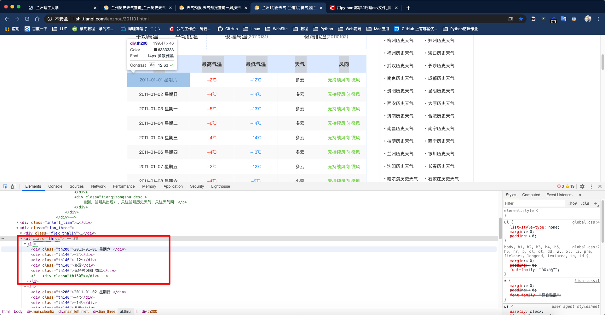
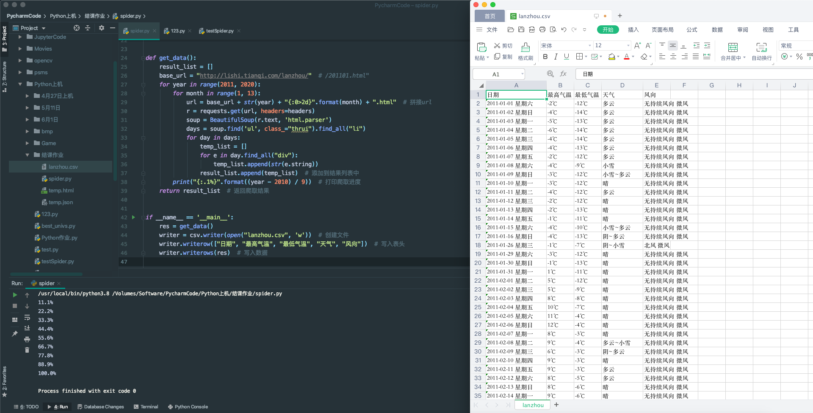

### 题目一：网络爬虫

### 兰州历史天气爬取

题目一：从历史天气网[https://www.tianqi.com/](https://www.tianqi.com/)爬取兰州2011-2019年每天的天气信息，包括"日期", "最高气温", "最低气温", "天气", "风向"五项内容。

[网页地址：http://lishi.tianqi.com/lanzhou/201101.html](http://lishi.tianqi.com/lanzhou/201101.html)


只爬取2011年-2019年的天气信息

分析url 如http://lishi.tianqi.com/lanzhou/201101.html可知， 2011为年份，01为月份，因此可采用字符串拼接的方式得到2011-2019年每个月天气信息的url链接，遍历每个月的url，获取天气信息。

```python
base_url = "http://lishi.tianqi.com/lanzhou/"  # /201101.html"
for year in range(2011, 2020):
    for month in range(1, 13):
        url = base_url + str(year) + "{:0>2d}".format(month) + ".html"  # 拼接url
        r = requests.get(url, headers=headers)
        soup = BeautifulSoup(r.text, 'html.parser')
```

找到class=thrui的ul标签下的所有li标签，提取其中的信息，保存到列表中。



```python
days = soup.find('ul', class_="thrui").find_all("li")
for day in days:
    temp_list = []
    for e in day.find_all("div"):
        temp_list.append(str(e.string))
    result_list.append(temp_list)  # 添加到结果列表中
```

打印爬取进度

```python
print("{:.1%}".format((year - 2010) / 9))  # 打印爬取进度
```

将爬取到的数据保存到CSV文件中

```python
if __name__ == '__main__':
    res = get_data()
    writer = csv.writer(open("lanzhou.csv", 'w', newline=''))  # 创建文件  windwos需要加关键字参数newline=“”， 否则会有空行
    writer.writerow(["日期", "最高气温", "最低气温", "天气", "风向"])  # 写入表头
    writer.writerows(res)  # 写入数据
```

#### 源程序

```python
import requests
from bs4 import BeautifulSoup
import random
import csv

my_headers = [
    "Mozilla/5.0 (Windows NT 6.3; WOW64) AppleWebKit/537.36 (KHTML, like Gecko) Chrome/39.0.2171.95 Safari/537.36",
    "Mozilla/5.0 (Macintosh; Intel Mac OS X 10_9_2) AppleWebKit/537.36 (KHTML, like Gecko) Chrome/35.0.1916.153 Safari/537.36",
    "Mozilla/5.0 (Windows NT 6.1; WOW64; rv:30.0) Gecko/20100101 Firefox/30.0",
    "Mozilla/5.0 (Macintosh; Intel Mac OS X 10_9_2) AppleWebKit/537.75.14 (KHTML, like Gecko) Version/7.0.3 Safari/537.75.14",
    "Mozilla/5.0 (compatible; MSIE 10.0; Windows NT 6.2; Win64; x64; Trident/6.0)",
    'Mozilla/5.0 (Windows; U; Windows NT 5.1; it; rv:1.8.1.11) Gecko/20071127 Firefox/2.0.0.11',
    'Opera/9.25 (Windows NT 5.1; U; en)',
    'Mozilla/4.0 (compatible; MSIE 6.0; Windows NT 5.1; SV1; .NET CLR 1.1.4322; .NET CLR 2.0.50727)',
    'Mozilla/5.0 (compatible; Konqueror/3.5; Linux) KHTML/3.5.5 (like Gecko) (Kubuntu)',
    'Mozilla/5.0 (X11; U; Linux i686; en-US; rv:1.8.0.12) Gecko/20070731 Ubuntu/dapper-security Firefox/1.5.0.12',
    'Lynx/2.8.5rel.1 libwww-FM/2.14 SSL-MM/1.4.1 GNUTLS/1.2.9',
    "Mozilla/5.0 (X11; Linux i686) AppleWebKit/535.7 (KHTML, like Gecko) Ubuntu/11.04 Chromium/16.0.912.77 Chrome/16.0.912.77 Safari/535.7",
    "Mozilla/5.0 (X11; Ubuntu; Linux i686; rv:10.0) Gecko/20100101 Firefox/10.0 "
]
headers = {'User-Agent': random.choice(my_headers)}


def get_data():
    result_list = []
    base_url = "http://lishi.tianqi.com/lanzhou/"  # /201101.html"
    for year in range(2011, 2020):
        for month in range(1, 13):
            url = base_url + str(year) + "{:0>2d}".format(month) + ".html"  # 拼接url
            r = requests.get(url, headers=headers)
            soup = BeautifulSoup(r.text, 'html.parser')
            days = soup.find('ul', class_="thrui").find_all("li")
            for day in days:
                temp_list = []
                for e in day.find_all("div"):
                    temp_list.append(str(e.string))
                result_list.append(temp_list)  # 添加到结果列表中
        print("{:.1%}".format((year - 2010) / 9))  # 打印爬取进度
    return result_list  # 返回爬取结果


if __name__ == '__main__':
    res = get_data()
    writer = csv.writer(open("lanzhou.csv", 'w', newline=''))  # 创建文件  windwos需要加关键字参数newline=“”， 否则会有空行
    writer.writerow(["日期", "最高气温", "最低气温", "天气", "风向"])  # 写入表头
    writer.writerows(res)  # 写入数据
```

#### 源程序截图


#### 运行结果截图



